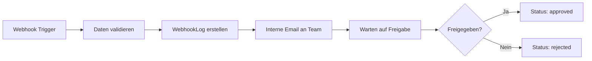
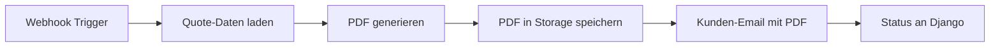

# n8n-Integration: Implementierungsplan

**Status:** In Planung
**Erstellt:** 2025-11-12
**Projekt:** EDGARD Elektro PV-Service

---

## 📋 TODO-Liste

### Phase 1: Django Backend vorbereiten
- [x] Webhook-Models in integrations/models.py erstellen
- [ ] Webhook-Endpoint für Precheck-Submit implementieren
- [ ] Signal-Handler für Quote-Freigabe erstellen
- [ ] API-Endpoints für n8n registrieren
- [ ] n8n-Workflow Dokumentation schreiben

### Phase 2: n8n-Workflow-Design
- [ ] Workflow 1: Precheck → Quote erstellen
- [ ] Workflow 2: Quote-Status-Updates implementieren
- [ ] Email-Templates designen
- [ ] PDF-Generator in n8n integrieren

### Phase 3: Email-Templates
- [ ] Eingangsbestätigung (sofort nach Precheck)
- [ ] Interne Prüf-Email (an Team)
- [ ] Angebot freigegeben (an Kunde mit PDF)
- [ ] Terminbestätigung (nach Termin-Buchung)

### Phase 4: Testing & Deployment
- [ ] Webhook-Endpoints testen
- [ ] n8n-Workflows testen
- [ ] Email-Versand testen
- [ ] Integration End-to-End testen
- [ ] Dokumentation vervollständigen

---

## 🎯 Schritt-für-Schritt-Plan

### **Phase 1: Django Backend vorbereiten**

#### **Schritt 1.1: Webhook-Models erstellen**
Dateien: `apps/integrations/models.py`

Benötigte Models:
```python
- WebhookLog (Tracking aller n8n Calls)
  - event_type (precheck_submitted, quote_approved, etc.)
  - payload (JSONField)
  - status (pending, success, failed)
  - response (JSONField)
  - created_at, updated_at

- N8nWorkflowStatus (Status-Tracking pro Precheck/Quote)
  - precheck (ForeignKey)
  - quote (ForeignKey, optional)
  - workflow_id (n8n workflow ID)
  - status (initiated, in_review, approved, sent, failed)
  - last_event_at
```

#### **Schritt 1.2: Webhook-Endpoints implementieren**
Dateien: `apps/integrations/views.py`, `apps/integrations/urls.py`

Benötigte Endpoints:
```python
POST /api/integrations/n8n/precheck-submitted/
  - Empfängt Precheck-Daten nach Form-Submit
  - Validiert Payload
  - Triggert n8n-Workflow
  - Gibt Status zurück

POST /api/integrations/n8n/quote-approved/
  - Empfängt Quote-Freigabe
  - Triggert PDF-Generierung
  - Triggert Kunden-Email

GET /api/integrations/n8n/status/<precheck_id>/
  - Gibt aktuellen Workflow-Status zurück
```

#### **Schritt 1.3: Signal-Handler für Quote-Freigabe**
Dateien: `apps/quotes/signals.py`

```python
@receiver(post_save, sender=Quote)
def quote_approved_handler(sender, instance, **kwargs):
    if instance.status == 'approved' and not kwargs.get('created'):
        # Webhook an n8n senden
        # Payload: Quote-Daten + PDF-URL + Kunde
```

#### **Schritt 1.4: API-Endpoints registrieren**
Dateien: `apps/integrations/urls.py`, `edgard_site/urls.py`

```python
# apps/integrations/urls.py
urlpatterns = [
    path('n8n/precheck-submitted/', views.precheck_submitted_webhook),
    path('n8n/quote-approved/', views.quote_approved_webhook),
    path('n8n/status/<int:precheck_id>/', views.workflow_status),
]

# edgard_site/urls.py
path('api/integrations/', include('apps.integrations.urls')),
```

---

### **Phase 2: n8n-Workflow-Design**

#### **Workflow 1: Precheck → Quote Review**



**n8n Nodes:**
1. **Webhook-Trigger** (POST von Django)
2. **Function Node:** Payload validieren
3. **HTTP Request:** Django API - Status Update
4. **Email Node:** Interne Benachrichtigung
5. **Wait Node:** Warten auf manuelle Freigabe
6. **IF Node:** Freigabe-Entscheidung
7. **HTTP Request:** Workflow 2 triggern

#### **Workflow 2: Quote Approved → Kunde benachrichtigen**



**n8n Nodes:**
1. **Webhook-Trigger** (von Workflow 1 oder Django Signal)
2. **HTTP Request:** Django API - Quote-Daten laden
3. **PDF Generator Node:** Angebot als PDF
4. **S3/MinIO Node:** PDF hochladen (optional)
5. **Email Node:** Kunden-Email mit PDF-Anhang
6. **HTTP Request:** Django API - Status Update

---

### **Phase 3: Email-Templates**

#### **Template 1: Eingangsbestätigung**
**Trigger:** Sofort nach Precheck-Submit
**An:** Kunde
**Betreff:** Ihre PV-Anfrage ist bei uns eingegangen

```html
Guten Tag {customer_name},

vielen Dank für Ihre Anfrage zu unserem PV-Elektroservice.

Wir haben Ihre Daten erhalten und prüfen diese umgehend.
Sie erhalten innerhalb von 24 Stunden ein unverbindliches Angebot.

**Ihre Anfrage:**
- Standort: {site_address}
- WR-Leistung: {desired_power_kw} kW
- Speicher: {storage_kwh} kWh
- Wallbox: {wallbox_status}

Bei Rückfragen erreichen Sie uns unter:
Tel: {company_phone}
Email: {company_email}

Mit freundlichen Grüßen
Ihr EDGARD Elektro Team
```

#### **Template 2: Interne Prüf-Email**
**Trigger:** Nach Precheck-Submit
**An:** Team/Admin
**Betreff:** Neue PV-Anfrage #{precheck_id} - {customer_name}

```html
Neue PV-Anfrage eingegangen:

**Kunde:**
- Name: {customer_name}
- Email: {customer_email}
- Telefon: {customer_phone}

**Projekt:**
- Standort: {site_address}
- Hauptsicherung: {main_fuse_ampere} A
- Netzform: {grid_type}
- WR-Leistung: {desired_power_kw} kW
- Speicher: {storage_kwh} kWh
- Wallbox: {wallbox_details}

**Kalkulierter Preis:**
- Paket: {package}
- Netto: {total_net} €
- Brutto: {total_gross} €

**Aktionen:**
[Angebot freigeben] [Rückfragen stellen] [Ablehnen]

Dashboard: {dashboard_url}
```

#### **Template 3: Angebot freigegeben**
**Trigger:** Nach manueller Freigabe
**An:** Kunde
**Betreff:** Ihr PV-Angebot von EDGARD Elektro

```html
Guten Tag {customer_name},

anbei erhalten Sie unser Angebot für Ihr PV-Projekt.

**Ihr Projekt:**
- Paket: {package_name}
- Leistung: {desired_power_kw} kW
- Gesamtpreis: {total_gross} € (inkl. MwSt.)

Das Angebot finden Sie im Anhang als PDF.

**Nächste Schritte:**
1. Angebot prüfen
2. Termin vereinbaren: {scheduling_link}
3. Vor-Ort-Besichtigung

Das Angebot ist gültig bis {valid_until}.

Bei Fragen stehen wir Ihnen gerne zur Verfügung.

Mit freundlichen Grüßen
Ihr EDGARD Elektro Team

[Anhang: Angebot_{precheck_id}.pdf]
```

#### **Template 4: Terminbestätigung**
**Trigger:** Nach Termin-Buchung
**An:** Kunde
**Betreff:** Terminbestätigung - PV-Installation

```html
Guten Tag {customer_name},

wir bestätigen Ihren Termin:

**Termin:**
- Datum: {appointment_date}
- Uhrzeit: {appointment_time}
- Adresse: {site_address}
- Dauer: ca. {duration} Stunden

**Vorbereitung:**
- Zugang zu Zählerschrank sicherstellen
- Komponenten bereithalten (falls Eigenlieferung)
- Parkplatz für Servicefahrzeug

Bei Änderungen kontaktieren Sie uns bitte mindestens 24h vorher.

Kalender-Eintrag im Anhang.

Mit freundlichen Grüßen
Ihr EDGARD Elektro Team

[Anhang: Termin.ics]
```

---

## 🔧 Technische Details

### Django → n8n Webhook-Payload Format

#### Precheck-Submitted Event
```json
{
  "event": "precheck_submitted",
  "timestamp": "2025-11-12T14:30:00Z",
  "precheck_id": 123,
  "customer": {
    "name": "Max Mustermann",
    "email": "max@example.com",
    "phone": "+49 40 12345678"
  },
  "site": {
    "address": "Musterstraße 1, 20095 Hamburg",
    "main_fuse_ampere": 35,
    "grid_type": "3p"
  },
  "system": {
    "desired_power_kw": 10.0,
    "storage_kwh": 5.0,
    "has_wallbox": true,
    "wallbox_class": "11kw",
    "wallbox_mount": "wall",
    "wallbox_cable_length": 15.0
  },
  "pricing": {
    "package": "pro",
    "total_net": 3250.00,
    "total_gross": 3867.50,
    "breakdown": {
      "base_package": 2290.00,
      "wallbox": 1290.00,
      "cable": 270.00,
      "travel": 0.00
    }
  },
  "dashboard_url": "http://192.168.178.30:8025/dashboard/precheck/123/"
}
```

#### Quote-Approved Event
```json
{
  "event": "quote_approved",
  "timestamp": "2025-11-12T15:45:00Z",
  "quote_id": 456,
  "precheck_id": 123,
  "approved_by": "admin@edgard.de",
  "customer": {
    "name": "Max Mustermann",
    "email": "max@example.com"
  },
  "quote": {
    "pdf_url": "http://192.168.178.30:8025/media/quotes/quote_456.pdf",
    "valid_until": "2025-12-12",
    "total_gross": 3867.50
  }
}
```

### n8n → Django Webhook-Payload Format

#### Status-Update von n8n
```json
{
  "precheck_id": 123,
  "status": "email_sent",
  "workflow_id": "n8n-workflow-abc123",
  "timestamp": "2025-11-12T16:00:00Z",
  "details": {
    "email_sent_to": "max@example.com",
    "pdf_attached": true,
    "delivery_status": "delivered"
  }
}
```

---

## 🔐 Sicherheit & Authentifizierung

### Webhook-Authentifizierung
```python
# Option 1: API Key in Header
headers = {
    'X-N8N-API-KEY': 'secret_key_here'
}

# Option 2: HMAC Signature
import hmac
import hashlib

signature = hmac.new(
    secret_key.encode(),
    payload.encode(),
    hashlib.sha256
).hexdigest()

headers = {
    'X-Webhook-Signature': signature
}
```

### Django Settings
```python
# settings.py
N8N_WEBHOOK_URL = config('N8N_WEBHOOK_URL')
N8N_API_KEY = config('N8N_API_KEY')
N8N_WEBHOOK_SECRET = config('N8N_WEBHOOK_SECRET')
```

---

## 📊 Monitoring & Logging

### WebhookLog Model
```python
class WebhookLog(models.Model):
    event_type = models.CharField(max_length=50)
    direction = models.CharField(
        max_length=10,
        choices=[('outgoing', 'To n8n'), ('incoming', 'From n8n')]
    )
    payload = models.JSONField()
    response = models.JSONField(null=True, blank=True)
    status = models.CharField(
        max_length=20,
        choices=[
            ('pending', 'Pending'),
            ('success', 'Success'),
            ('failed', 'Failed'),
            ('retry', 'Retry')
        ]
    )
    error_message = models.TextField(blank=True)
    retry_count = models.IntegerField(default=0)
    created_at = models.DateTimeField(auto_now_add=True)
    updated_at = models.DateTimeField(auto_now=True)
```

### Admin-Dashboard Übersicht
```python
# apps/integrations/admin.py
@admin.register(WebhookLog)
class WebhookLogAdmin(admin.ModelAdmin):
    list_display = ['event_type', 'direction', 'status', 'created_at']
    list_filter = ['status', 'direction', 'event_type']
    search_fields = ['payload', 'error_message']
    readonly_fields = ['created_at', 'updated_at']
```

---

## 🚀 Deployment-Checkliste

### Vor dem Go-Live
- [ ] n8n installiert und konfiguriert
- [ ] SMTP/Email-Provider konfiguriert
- [ ] Webhook-URLs in Django settings
- [ ] API-Keys generiert und gesichert
- [ ] Email-Templates getestet
- [ ] Test-Durchlauf mit echten Daten
- [ ] Error-Handling & Retry-Logik getestet
- [ ] Monitoring & Logging aktiv

### Umgebungsvariablen
```bash
# .env
N8N_WEBHOOK_URL=https://n8n.edgard.de/webhook/precheck
N8N_API_KEY=your_secret_api_key_here
N8N_WEBHOOK_SECRET=webhook_signature_secret

EMAIL_HOST=smtp.gmail.com
EMAIL_PORT=587
EMAIL_HOST_USER=noreply@edgard.de
EMAIL_HOST_PASSWORD=your_email_password
EMAIL_USE_TLS=True
DEFAULT_FROM_EMAIL=noreply@edgard.de
```

---

## 📖 Referenzen

### Externe Dokumentation
- [n8n Webhook Documentation](https://docs.n8n.io/integrations/builtin/core-nodes/n8n-nodes-base.webhook/)
- [Django Signals](https://docs.djangoproject.com/en/4.2/topics/signals/)
- [DRF Webhooks](https://www.django-rest-framework.org/api-guide/views/)

### Interne Dokumentation
- [CLAUDE.md](CLAUDE.md) - Hauptdokumentation
- [CLAUDE_API.md](CLAUDE_API.md) - API Details
- [CLAUDE_DEPLOYMENT.md](CLAUDE_DEPLOYMENT.md) - Deployment Guide

---

## 🎯 Nächste Schritte

1. **Entscheidung treffen:** Welche Implementierungs-Option?
   - Option A: Sofort Django-Backend starten
   - Option B: Erst n8n-Setup dokumentieren
   - Option C: Parallele Agenten (schnellster Weg)

2. **Infrastruktur klären:**
   - n8n Cloud oder Self-Hosted?
   - Email-Provider festlegen
   - PDF-Generator-Lösung wählen

3. **Implementierung starten:**
   - Models erstellen
   - Webhooks implementieren
   - n8n-Workflows aufsetzen
   - Testing durchführen

---

**Letzte Aktualisierung:** 2025-11-12
**Nächstes Review:** Nach Phase 1 Abschluss
